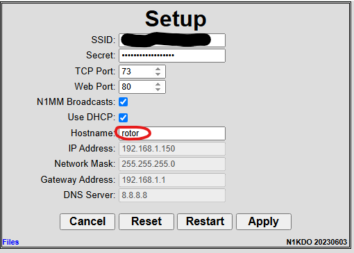
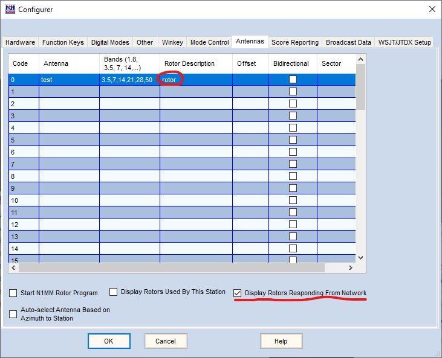
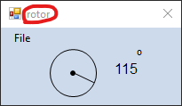

# Using the Rotator Controller-Controller with N1MM+

The rotator controller-controller software supports UDP messages in order that 
the connected rotator can be controlled with N1MM+.  You don't need any wires 
other than what connects the logging computer to the rotator controller-controller.

## Setup

Check the `N1MM Broadcasts` box, and make sure you have a unique `hostname` set.

## N1MM+ Setup

On the N1MM+ _configurator_ dialog, in the _Antennas_ tab, create an entry for an antenna,
specify the bands of that antenna, and make sure to use the _hostname_ specified above as the 
"Rotor Description."  The name must match exactly.

**Do not check** the "Start N1MM Rotor Program" -- you don't need it, you won't be using it.

Check one or both of the "Display Rotors" options.  The "...Responding from Network" option
will show all rotors that are reachable on the network; this will show you where the rotor(s)
are pointed _whether your station is using them or not._

## Operating

You should see a small window that shows the bearing of each configured rotor.  You will see the
rotor name/host name in the title bar of that window.

You can "move" the rotor by typing a bearing into the N1MM logger callsign box and pressing Alt-J.
This should turn the rotor to the new bearing.

N1MM has other tricks to turn a configured rotor; those are beyond the scope of this document.

---

n1kdo 2025-06-25

