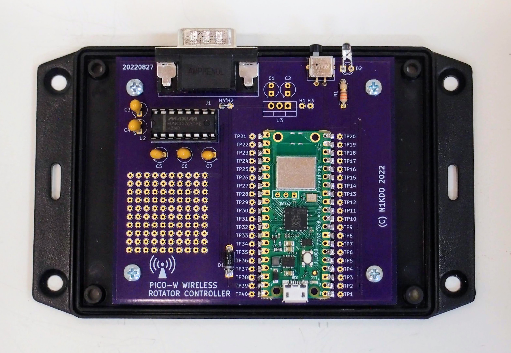
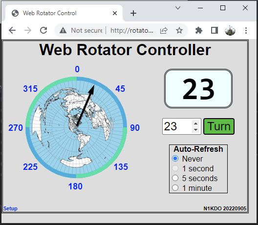
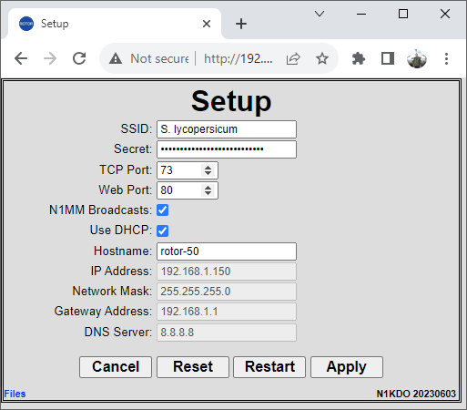
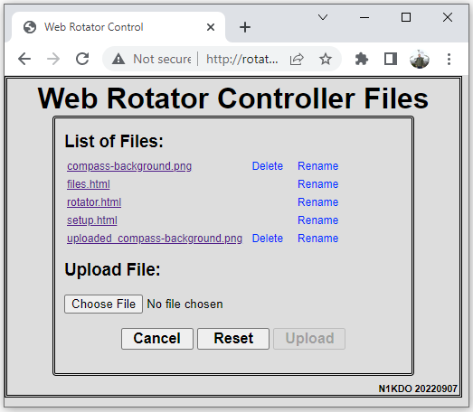

# A Wireless Rotator Controller-Controller

Or: _How to Add Internet-of-Things Capabilities to Legacy Products_   
Jeff Otterson, N1KDO



## Introduction

I live in a HOA neighborhood, which means no towers, no permanently installed visible antennas. For several years I have
been using a small 3-element Yagi which I temporarily erect on a tripod mount on my back patio for the May-August
6-meter Es season. This works well, but I have grown tired of “Armstrong”-style rotation of this antenna. I wanted to
use my Ham-IV antenna rotator to turn this antenna but did not want to go to the trouble of installing—and 
lightning-protecting the wiring for the rotator. Instead, I decided to find an approach to inexpensively add wireless 
control to the antenna rotator.

The first step was to modify the Ham-IV control box to add a computer interface. I bought the “Rotor-EZ” kit from
HamSupply (note 1) and installed it, to add RS-232 serial communications support to the Ham-IV. The Rotor-EZ uses the
same protocol as the HyGain DCU-3 and several other rotator controllers. This got me closer to my goal, but RS-232 still
needs wires!

In June 2022, the Raspberry Pi foundation announced their new “Raspberry Pi Pico-W” (note 2) – when I saw this new part,
I realized it was “just what the doctor ordered” for my project. I bought a few and started experimenting.

This article describes the results of my work: a wireless rotator controller-controller. The project connects the
rotator controller to your Wi-Fi network and allows both web-based and computer access to the rotator over wireless. The
approach I present here is useful for other Amateur Radio Internet-of-Things projects; I already have plans to use this
as a basis for wireless control of a remote antenna switch.

## How it works

If you look at the [schematic diagram](schematic.pdf), you will notice that there are very few electronic components.
Most of the components are used in the RS-232 level conversion. Like most everything else, this project is mostly in the
software.

The software can be grouped into two major parts: the “front-end” and the “back-end.” The back-end software runs on the
Pico-W and provides the web server, network serial port listener, and serial port communications to the rotator
controller. The back end is implemented in “Micro-Python,” (note 3) a version of Python that has been “optimized to run
on microcontrollers.”

The front-end software runs on your web browser and is implemented in HTML, CSS, and JavaScript. All the software is
open-source, licensed under the BSD “2-clause” license, and is available from my GitHub repository. (note 4)

The “hardware” is quite simple. The Pico-W operates at 3.3 volts, but the RS-232 interface presented by the rotator
controller operates at -12 and +12 volts (ideally). A Maxim MAX3232 IC is used to convert the voltage levels between 3.3
volts and RS-232 levels. There is also a LED and current limiting resistor, and the “mode” pushbutton.

## Construction

The basic circuit has only 10 electronic components in addition to the Pico-W. It can easily be built on perf board;
this is how I built my prototype. I laid out a circuit board that makes assembly and packaging easy. Both the schematic
and the circuit board were designed using the open-source Kicad 6 software; all the artifacts are in the GitHub
repository.

No particular care is needed in the wiring as all the signals are low speed. Attention should be given to the polarity
of the tantalum capacitors, the Schottky diode, and the LED. The LED needs the leads bent 90 degrees about 1/8 of an
inch from the body, with the shiny part of the LED facing away from you, and the longer lead on the right, carefully
bend the legs down so that the LED will slightly hang over the edge of the board.

You can mount the Pico-W directly to the circuit board. This is a bit fiddly, and there is one chance to get it right. I
suggest inserting a three-pin header through the “DEBUG” holes on the Pico-W to set the preliminary alignment. Solder
down one corner pin of the Pico-W, then inspect the alignment. Carefully re-heat that joint if you need to slightly move
the Pico-W. When you are happy with the alignment, then you can solder the other corner down, and check again. Then
solder the rest of the pins.

If you choose not to directly solder the Pico-W to the circuit board, you could mount it on headers and install sockets
onto the circuit board.

The circuit board is designed to fit into a Hammond plastic enclosure. I like Hammond because they support amateur radio
with advertising and the occasional hamfest booth. The board is meant to be mounted on the flanged lid of the enclosure;
you can either cut slots or carefully drill and cut to allow access to the DE-9 connector, mode pushbutton, and status
LED.

## Powering the circuit

There are three methods of powering the circuit. While installing the Rotor-EZ into my rotator controller, I hard-wired
+5 volts to pin 1 of the DE9 connector from the rotator controller. (This pin is normally used as “carrier detect” for a
MODEM, it is safe to put +5 here, it will not blow up any connected equipment.) Install a wire jumper from H2 to H4 on
the board to “rob” power from the rotator controller.

The circuit can also be powered through the micro-USB connector on the Pico-W and a cellphone charger can be used to
power it through this connector. When installing software, the board is powered by the host through the USB connection.

Finally, to support further experimentation, the board has provisions to allow the installation of a 7805 voltage
regulator and associated bypass capacitors. Unregulated voltage is supplied on H1, and ground is on H3.

## The Playground

I knew I had other ideas for this project, I added a 10x10 grid of solder pads to the board for future experimentation.
The top row of pins is wired to +3.3 volts, and the bottom row of pins to ground. In addition, every pin of the Pico-W
is brought out to a “test point” hole, so the signals are easy to access.

## Installing the Software

There are two phases to installing the software on the device. The first phase is to install MicroPython and the second
is to install the controller-controller software. Instructions for both operations are in the GitHub repository.

## Using the Controller-Controller

The controller-controller web interface provides three different functions: rotator operation, configuration, and
customization. Each is described below.

## Operating Mode

  
Figure 1: Rotator Controller-Controller operating page

The primary operating mode allows rotation of the antenna. Figure 1 shows this page. This web page shows the current
bearing of the antenna, provides quick links for eight different directions, and allows the bearing to be entered. The
direction indicator arrow will move as the rotator turns. In addition, the bearing indicator can be set up to
automatically update periodically, which is useful if the rotator is being commanded from more than one location.

## Setup Mode

  
Figure 2: Setup Page

Figure 2 shows the “setup” page for the controller-controller. This page allows you to configure the SSID and secret
used to connect to your Wi-Fi network and allows the TCP port number for the web interface and network serial
connection. You can access this page by clicking the “Setup” link in the lower left corner of the operating mode page.

## Files Upload

  
FIgure 3: Files page

Figure 3 shows the “Files” page for the controller-controller. This page allows you to customize the look and feel of
the device by modifying the HTML and other assets. This can be dangerous since these HTML files provide the look and
feel of the web interface. The existing implementation of this page does not allow the deletion of any .html file and
renames every uploaded file with the prefix “uploaded_” in order to prevent disaster. You can upload new files and test
them prior to deleting existing files and renaming the uploaded files. Extreme care should be taken if you choose to
modify “files.html” – if you damage the functionality provided here, you will need to find another way to re-install a
working version. Be careful!

## Network Serial Port Operation

While a web interface to your rotator controller is certainly useful, the project also allows computer control of the
rotator through network serial port emulation. This allows your logging or contesting software to command the rotator
over the network. If your software does not support network serial port access (most does not) then you can use software
like ‘com0com’ and ‘com2tcp’ (note 5) to create a “virtual” serial port on your PC that connects to the rotator
controller-controller through the network. I have verified that this works by testing with both “LP-Rotor”  (note 6) and
“DXView” (note 70. Consult your favorite search engine for com0com and com2tcp set up information.

## N1MM+ Integration

The rotator controller-controller can also interoperate with N1MM+. It accepts and transmits UDP network messages that
allow the rotator to be directly controlled over the network with N1MM+.

## Chickens and Eggs

The controller-controller has a setup web page that allows you to set the SSID and secret to connect to you Wi-Fi
network, but how can you access this page if the controller is not already connected to your network? This is the
function of the “mode” button. When the mode button is pressed, the controller-controller restarts as a Wi-Fi access
point named “Rotator” with the secret password “NorthSouth”. Connect to this access point with your phone or other Wi-Fi
device. Some devices will complain that this network does not offer Internet access--that is ok, because it does not!
You may need to check a box to keep your device connected to this network.

Once connected to the “Rotator” network, use your web browser to access the controller-controller by loading the web
page at http://192.168.4.1 – from here you can click the “Setup” link and configure the controller-controller. After you
enter your network’s SSID and secret, click the “Apply” button to save the configuration, and then press the “Restart”
button to return the controller-controller to normal mode.

Access point mode can also be used in locations where there is no Wi-Fi service, the controller-controller is completely
usable in access point mode.

## A note about IP addressing

The controller-controller blinks out its current IP address on the LED in Morse code. The code speed is slow enough that
you can copy it by pencil, writing down the dits and dahs and later translating by hand if that is needed. When in
access point mode, the IP address is prefixed with the letters “AP” to indicate this mode. If it cannot connect to your
network, it will blink out “0 0 0 0” – this is an error condition, and you will need to use the mode button to select
access point mode to retry the configuration.

If your network router supports the feature, I recommend using “static DHCP” so that the controller-controller will
always receive the same IP address. The board may appear on your router as a device named “PYBD”. Consult your router’s
documentation for instructions to set up static DHCP.

## The Compass Background

One file you might see on the Files page is named “compass-background.png”. This file can be used to draw a “great
circle” map behind the bearing indicator. The file is a 200x200 “png” image with a transparent background, which
contains a 200-pixel diameter great circle map. The version supplied with the project has the great circle centered at
Atlanta, Georgia. I created this map from results obtained from NS6T’s “Request an Azimuthal Map” (note 8), and a little
bit of effort in an image editor to resize and adjust.

## Warning

There is no HTTPS/TLS (network encryption) in this project, for a variety of reasons, notably the effort and complexity
needed to set up new SSL certificates. All network traffic is in the clear. Therefore, this device should not be
connected to the public Internet. Your home Wi-Fi network is fine, but I do not recommend “port-forwarding” to allow
outside access. If this is needed, you should investigate other methods of remote access, possibly using a VPN.

Also, there is no authentication needed to turn the antenna. No usernames or passwords are used. Anybody on your network
can access the rotator controller-controller.

## Happy Hacking!

It is my hope that this project will be useful by itself, but also serve as a base for experimenters to create their own
IOT integrations with their existing gear. The Pico-W represents a tremendous opportunity to build this kind of stuff on
the cheap. I hope you find this project useful and interesting.

## Parts List

```
C1-C7 .1 uF 35V tantalum capacitor, KEMET T350A104M035AT or similar, see notes
D1 1N5819 40V 1A Schottky Diode
D2 T1 White LED, LITEON LTW-420D7 or similar
J1 DE9P connector, Amphenol L717SDE09PA4CH4RC309
R1 330 ohm ¼ watt leaded resistor
SW1 SPST-NO pushbutton, NKK Switches GB215AH
SW1-cap pushbutton cap NKK Switches AT4063A
U1 Raspberry Pi Pico-W, see notes 
U2 MAX3232 16-pin DIP MAXIM MAX3232ECPE+
U3 7805 three-terminal 5V regulator in TO-220 case, TI UA7805CKCT or similar, see notes
Enclosure: Hammond 1591XXSFLBK
```

### Notes:

If you decide to include the 5 volt regulator parts, include C1, C2, and C3, otherwise, these are not needed.

The Raspberry Pi Pico-W is in short supply. I have bought some from Vilros.com, SparkFun.com, and CanaKit.com (from
Canada). Adafruit.com also lists them. They are inexpensive enough, and so much fun, that I will usually buy two when I
find availability.

## References

1. "Rotor-EZ for Hy-Gain Rotator Control," HamSupply.com, 2022. [Online].
   Available: https://www.hamsupply.com/rotor-ez-hy-gain-rotor-control/.
2. E. Upton, "Raspberry Pi Pico W: your $6 IoT platform," Raspberry Pi Foundation, 30 June 2022. [Online].
   Available: https://www.raspberrypi.com/news/raspberry-pi-pico-w-your-6-iot-platform/.
3. D. George, "MicroPython," George Robotics, 2018. [Online]. Available: https://micropython.org/.
4. J. Otterson, "rotator-controller-controller," N1KDO, 17 September 2022. [Online].
   Available: https://github.com/n1kdo/rotator-controller-controller.
5. vfrolov, "Null-modem emulator," Sourceforge.com, 09 April 2018. [Online].
   Available: https://sourceforge.net/projects/com0com/.
6. L. Phipps, "http://www.telepostinc.com/LP-Rotor-Html/," Telepost, Inc, 2003. [Online].
   Available: http://www.telepostinc.com/LP-Rotor-Html/.
7. D. Bernstein, "DXView," AA6YQ, 20 April 2022. [Online]. Available: https://www.dxlabsuite.com/dxview/.
8. T. Epperly, "Request an Azimuthal Map," NS6T, 2013. [Online]. Available: https://ns6t.net/azimuth/azimuth.html.

