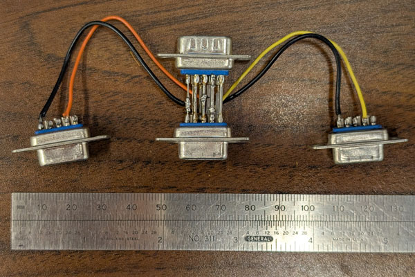

# Diagnostic/Development tools.

I built some tools to examine the data communications between apps and rotators while building this.

The tools are:

## line_tap.py

line_tap.py listens to serial data, both transmit and receive, using two additional serial ports.

It uses a "custom" tap to sense the transmit and receive lines on the RS-232 interface, and it sends
that data to the two ports described above.

I used this to listen in on serial traffic to and from the rotor control box (amongh other things.)

The harware tap has proven very useful for reverse-engineering serial protocols.

### Serial tap for reverse engineering

#### Serial Tap Wiring.

All pins are wired through from the device under test (DUT) _plug_ to the 
host socket.  Ground (pin 5) is wired to both the RX Tap and TX Tap grounds.  DUT TX
is wired to the TX Tap RX, and Host RX is wired to the RX Tap RX line.  The `line_tap.py`
script displays data from both paths.

| Pin | DE-9S Host | DE-9P DUT | DE-9P RX Tap | DE-9P TX Tap |
|-----|------------|-----------|--------------|--------------|
| 1   | 1          | 1         |              |              |
| 2   | 2          | 2         | 2            |              |
| 3   | 3          | 3         |              | 2            |
| 4   | 4          | 4         |              |              |
| 5   | 5          | 5         | 5            | 5            |
| 6   | 6          | 6         |              |              |
| 7   | 7          | 7         |              |              |
| 8   | 8          | 8         |              |              |
| 9   | 9          | 9         |              |              |

# udp_listener.py

This script sends and receives Rotator control UDP messages to/from N1MM+

n1kdo 20250625